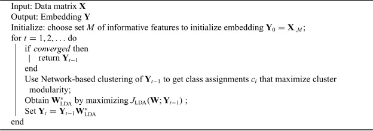

```{r setup, include = FALSE}
knitr::opts_chunk$set(
  collapse = TRUE,
  comment = "#>"
)
```


# Overview

The iDA package contains functions to create an embedding to reduce the dimensionality of high dimensional data as well as a clustering assignment which optimally separates latent clusters. This method leverages linear discriminant analysis (LDA) in order to find transformations which both separate classes from each other while also minimizing variance within each class. These classes can arise from both known (measured) and unknown (unmeasured) sources.  This embedding can be used as an interpretable reduction to characterize and investigate features which drive class separation or to correct for unwanted sources of variation in downstream analysis.


iDA can take in either a scRNA-seq dataset (as a SingleCellExperiment object) or a bulk-RNAseq dataset (in either a DESeqDataSet or SummarizedExperiment). iDA will check for needed normalization, do a feature selection step, and then perform the iterative LDA. The iDA method is performs the following steps:

******
**Algorithm 1**:  iDA Algorithm

******


# Installation 

```{r, eval = FALSE}
# Install BiocManager if needed
if (!requireNamespace("BiocManager", quietly = TRUE))
    install.packages("BiocManager")

# Install iDA
BiocManager::install("iDA")
```

# Libraries

```{r, message=FALSE}
library(iDA)
library(scRNAseq) 
library(celldex)
library(ggplot2)
library(Rtsne)
library(dplyr)
```


# Applying iDA to scRNA-seq data to estimate cell types and top discriminative markers

A common motivation of studies using scRNA-seq is to detect novel cell-types and identify marker genes that define these cell types. The current standard scRNA approach is to use PCA to reduce the computational cost of downstream analyses like unsupervised clustering for putative cell-type identification or non-linear transformations like tSNE or UMAP to visualize global cell-type differences.

Using PCA objective to detect latent discrete structure assumes that latent classes will in fact account for most of the dataset variance. However, since PCA is unsupervised, it does not necessarily separate classes. A more useful approach would be to find an embedding which defines the latent structure of the separation of cell types. iDA uses linear discriminant analysis (LDA) in an iterative approach to maximize the within-to-between cluster variance. The result is 1. vectors for each LD with gene weights which are class-discriminative and 2. a vector of cluster assignments for each cell. We can then evaluate the top weighted genes in each LD to identify putative cell types. 

since iDA uses a single value decomposition (SVD) of the gene x gene scatter matrices in each iterative step, this method scales relatively well for increasing cell number counts, but not as well for large gene numbers. To help with computational time, we perform a features selection step at the beginning of the method to to limit the size of the scatter matrices. 


                     
                                    

# Applying iDA to SummarizedExperiment object

This dataset is from the celldex package and contains normalized expression values for 259 bulk RNA-seq samples generated by Blueprint and ENCODE from pure populations of stroma and immune cells (Martens and Stunnenberg, 2013; The ENCODE Consortium, 2012). The samples were processed and normalized as described in Aran, Looney and Liu et al. (2019),


```{r, eval = FALSE}
BED <- BlueprintEncodeData(rm.NA = "none",
                           ensembl = FALSE,
                           cell.ont = c("nonna"))
```


We can then run iDA with the following:

```{r, eval = FALSE}
set.seed(11)
BED <- iDA(BED, cluster.method = "louvain")
```

The iDA embedding as well as cluster assignment labels will be added as column data as seen in the colData()

```{r, eval = FALSE}
head(colData(BED))
```


iDA has identified 11 clusters, and therefore 10 dimensions to best separate these clusters. We can now treat these LDs just as we would PCs as input to a non-linear dimensionality reduction to reduce this to 2 dimensions for clsuter visualization.

```{r, eval=FALSE}
set.seed(11)
tsne <- as.data.frame(colData(BED)) %>%
  select(contains("LD")) %>%
  Rtsne(pca = FALSE)

tsne$Y %>%
  as.data.frame() %>%
  ggplot(aes(x = V1, y = V2, color = as.factor(as.data.frame(colData(BED))$iDA_clusters))) + geom_point() + labs(color = "iDA Cluster")


tsne$Y %>%
  as.data.frame() %>%
  ggplot(aes(x = V1, y = V2, color = as.data.frame(colData(BED))$label.main)) + geom_point() + labs(color = "iDA Cluster")


as.data.frame(colData(BED)) %>%
  select(LD1, LD2, label.main, label.fine, iDA_clusters) %>%
  ggplot(aes(LD1, LD2, color = as.factor(iDA_clusters))) + geom_point() + theme(legend.position = "none")
```

# Compare to PCA

```{r, eval = FALSE}
BED_PCA <- scater::calculatePCA(BED)

set.seed(11)
tsne <- BED_PCA %>%
  Rtsne(pca = FALSE)

tsne$Y %>%
  as.data.frame() %>%
  ggplot(aes(x = V1, y = V2, color = as.data.frame(colData(BED))$label.main)) + geom_point() + labs(color = "label.main")
```


```{r, eval = FALSE}
# normalized expression values of 114 bulk RNA-seq samples of sorted immune cell populations that can be found in GSE107011.
MID <- MonacoImmuneData(ensembl = FALSE, cell.ont = c("nonna"))
set.seed(11)
MID <- iDA(MID, cluster.method = "louvain", nFeatures = 3500)


set.seed(11)
tsne <- as.data.frame(colData(MID)) %>%
  select(contains("LD")) %>%
  Rtsne(pca = FALSE)

tsne$Y %>%
  as.data.frame() %>%
  ggplot(aes(x = V1, y = V2, color = as.factor(as.data.frame(colData(MID))$iDA_clusters))) + geom_point() + labs(color = "iDA Cluster")


tsne$Y %>%
  as.data.frame() %>%
  ggplot(aes(x = V1, y = V2, color = as.factor(as.data.frame(colData(MID))$label.main))) + geom_point() + labs(color = "label.main")

```


```{r, eval = FALSE}
MID_PCA <- scater::calculatePCA(MID)

dim(assays(MID)[["logcounts"]])
dim(attr(MID_PCA,"rotation"))
set.seed(11)
tsne <- MID_PCA %>%
  Rtsne(pca = FALSE)

tsne$Y %>%
  as.data.frame() %>%
  ggplot(aes(x = V1, y = V2, color = as.data.frame(colData(MID))$label.main)) + geom_point() + labs(color = "label.main")
```


```{r, eval = FALSE}
# normalized expression values of 358 bulk RNA-seq samples of sorted cell populations that can be found at GEO.
mmu_RNA <- MouseRNAseqData(ensembl = FALSE, cell.ont = c("nonna"))
```


## QC data 
```{r, eval = FALSE}
# use the example dataset to perform quality control
data("sc_sample_data")
data("sc_sample_qc")
sce <- SingleCellExperiment(assays = list(counts = as.matrix(sc_sample_data)))
organism(sce) <- "mmusculus_gene_ensembl"
gene_id_type(sce) <- "ensembl_gene_id"
QC_metrics(sce) <- sc_sample_qc
demultiplex_info(sce) <- cell_barcode_matching
UMI_dup_info(sce) <- UMI_duplication
sce <- detect_outlier(sce)
sce <- remove_outliers(sce)
```


# iDA decomposition

We perform the iDA decomposition on the scaled sce data to get the clustering and embedding.
```{r, eval = FALSE}
sce <- iDA(sce)

#cluster assignments
sce_iDAident <- colLabels(sce)$iDAclusters

#iDA sample embedding
sce_iDAembedding <- as.data.frame(reducedDims(sce)$iDAcellweights)

#iDA gene weights 
#geneweights <- na.omit(rowData(sce))
```


We can see how many cells are in each cluster.

```{r, eval = FALSE}
count <- table(sce_iDAident)
count.df <- data.frame(count)

plot <- ggplot(count.df, aes(sce_iDAident, Freq, fill=sce_iDAident))

plot + geom_bar(stat="identity") + 
        labs(title="Cluster Counts",
                     y="Count", x="Cluster") + 
        theme(legend.position="none")
```


## tSNE of iDA decomposition

We will compare the iDA verus the PCA decomposion, so we'll do a tSNE of each decomp to compare the cluster separation
```{r, eval = FALSE}
set.seed(10)
tsne_iDA = as.data.frame(Rtsne(sce_iDAembedding, pca = FALSE)$Y)

ggplot(tsne_iDA, aes(x = V1, y = V2, col = as.factor(sce_iDAident))) + geom_point() + labs(color = "iDA Cluster")
```


# PCA decomposition

To compare what information we are gaining from iDA over a PCA reduction, we'll look at the tSNE of the PCA reduction to compare clusters.

```{r, eval = FALSE}
#find variable genes
var.features <- scran::getTopHVGs(sce)

#PCA of same rank as the iDA decomp
pca_data <- prcomp(t(logcounts(sce)[var.features,]), rank=10)

set.seed(10)
tsne_PCAsce <- as.data.frame(Rtsne(pca_data$x[,1:10], pca = FALSE)$Y)


ggplot(tsne_PCAsce, aes(x = V1, y = V2, col = as.factor(sce_iDAident))) + 
  geom_point() + 
  labs(color = "iDA Cluster")
```

Given this dataset with only highly variable genes, the PCA does a pretty good job of finding the separation between the discrete types. Interestingly, we see one cluster split with defined separation between PCA and iDA (cluster 4 (green) and 6 (blue)). We also note the more clearly defined separation of cluster 1 (red) in the iDA embedding as compared to the PCA one. We can evaluate the iDA embedding to see what dimension is defining this cluster split and what genes are highly weighted for this split.


# iDA embedding 

Once we determine which LD's we see separation between cluster 4 and 6 in, we can evaluate the highly weighted genes for those dimensions to see the expression differences between the clusters. 

```{r, eval = FALSE}
#LDs we see separation between cluster 4 and 6

#plot LD weight versus a dummy number so everything isn't piled on top of each other. so we are looking for separation in the x-axis direction. 

#LD7
ggplot(sce_iDAembedding, aes(x = LD7, y = 1:dim(sce_iDAembedding)[1], color = as.factor(sce_iDAident))) + geom_point()  + labs(colour="iDA Cluster") + xlab( "LD7 Weight") + ylab("Cell Number")

```

Now we can look at the top genes for each of these LD's to see which genes define the separation between cluster 4 and 6 (and other clusters if we want).


## look at top genes separating cluster 4 and 6

### LD7
```{r, eval = FALSE}
#LD7 top genes
topgenes_LD7 <- rownames(geneweights)[sort(abs(geneweights[,7]), index.return = TRUE, decreasing = TRUE)$ix[1:10]]
scescaled_topgenesLD7 <- as.data.frame(t(rbind(logcounts(sce)[topgenes_LD7,], as.factor(colLabels(sce)$iDAclusters))))

#in the top 10 genes, we see cluster 4 and 6 have different expression patterns
ggplot(scescaled_topgenesLD7, aes(group = as.factor(V11), y = ENSMUSG00000002944, col = as.factor(V11))) + geom_boxplot() + labs(colour = "iDA Cluster")

ggplot(scescaled_topgenesLD7, aes(group = as.factor(V11), y = ENSMUSG00000034761, col = as.factor(V11))) + geom_boxplot() + labs(colour = "iDA Cluster")

ggplot(scescaled_topgenesLD7, aes(group = as.factor(V11), y = ENSMUSG00000100862, col = as.factor(V11))) + geom_boxplot() + labs(colour = "iDA Cluster")

ggplot(scescaled_topgenesLD7, aes(group = as.factor(V11), y = ENSMUSG00000064357, col = as.factor(V11))) + geom_boxplot() + labs(colour = "iDA Cluster")

ggplot(scescaled_topgenesLD7, aes(group = as.factor(V11), y = ENSMUSG00000064353, col = as.factor(V11))) + geom_boxplot() + labs(colour = "iDA Cluster")

ggplot(scescaled_topgenesLD7, aes(group = as.factor(V11), y = ENSMUSG00000042066, col = as.factor(V11))) + geom_boxplot() + labs(colour = "iDA Cluster")

ggplot(scescaled_topgenesLD7, aes(group = as.factor(V11), y = ENSMUSG00000027346, col = as.factor(V11))) + geom_boxplot() + labs(colour = "iDA Cluster")

ggplot(scescaled_topgenesLD7, aes(group = as.factor(V11), y = ENSMUSG00000044468, col = as.factor(V11))) + geom_boxplot() + labs(colour = "iDA Cluster")

ggplot(scescaled_topgenesLD7, aes(group = as.factor(V11), y = ENSMUSG00000064354, col = as.factor(V11))) + geom_boxplot() + labs(colour = "iDA Cluster")

ggplot(scescaled_topgenesLD7, aes(group = as.factor(V11), y = ENSMUSG00000029780, col = as.factor(V11))) + geom_boxplot() + labs(colour = "iDA Cluster")
```

We see the top 10 highly weighted genes in the LD direction which best separates cluster 4 from 6 (LD7) show differing expression patterns between these two clusters. For further analysis, differential expression analysis could be done to see if these genes are truly differentially expressed between these clusters. 


# What to cite

The iDA package was published in Biostatistics in 2021. The full article can be found here:
https://doi.org/10.1093/biostatistics/kxab030

To cite the iDA package, please include the citation:
Theresa A Alexander, Rafael A Irizarry, Héctor Corrada Bravo, Capturing discrete latent structures: choose LDs over PCs, Biostatistics, 2021;, kxab030, https://doi.org/10.1093/biostatistics/kxab030


```{r}
sessionInfo()
```


The iDA cluster assignments are added as meta data to the "iDA_clust" slot. We can see how many cells are in each cluster.

```{r, eval = FALSE}
count <- table(sce_iDAident)
count.df <- data.frame(count)

plot <- ggplot(count.df, aes(sce_iDAident, Freq, fill=sce_iDAident))

plot + geom_bar(stat="identity") + 
        labs(title="Cluster Counts",
                     y="Count", x="Cluster") + 
        theme(legend.position="none")
```


## tSNE of iDA decomposition

Since iDA is still a linear dimensionality reduction method and the dimension will likely be larger than 2 (the dimension will always be k - 1), we may still want to pair this wil a non-linear method such as tSNE to visualize the clustering in a 2D plot.


```{r, eval = FALSE}
set.seed(10)
tsne_iDA = as.data.frame(Rtsne(sce_iDAembedding, pca = FALSE)$Y)

ggplot(tsne_iDA, aes(x = V1, y = V2, col = as.factor(sce_iDAident))) + geom_point() + labs(color = "iDA Cluster")
```

               
